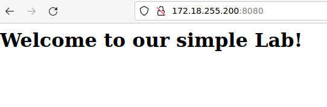

# README

## Prerequisites

Kubernetes cluster up and running

`kubectl` installed and configured to manage the above cluster


## Intro

We start from a simple `nginx` application.

Kubernetes manifests are stored  in `kubernetes-nginx`


## Kubernetes-nginx

This is a simple `nginx` application. Involved Kubernetes objects for this application are:

    - `Deployment` -> to deploy the `nginx` pods

    - `ConfigMap` -> to provide configuration to the pods (in our case to create an `index.html` to be statically served by `nginx`)

    - `Service` -> to create a `LoadBalancer` to route request to `nginx`


### Deploy resources

Move to `k8s-nginx` folder

Create a namespace (`k8s-nginx`) where to store the resources specified here in this folder

```
kubectl create namespace k8s-nginx
```

Create the ConfigMap

```
kubectl apply -f configmaps.yaml 
```

Create the Deployment

```
kubectl apply -f deployment.yaml 
```

Create the Service

```
kubectl apply -f svc.yaml 

```

Get information about the services in the `k8s-nginx` namespace

```
kubectl get svc -n k8s-nginx
```

Check output lists resource like the following

```
NAME            TYPE           CLUSTER-IP      EXTERNAL-IP      PORT(S)          AGE
nginx-service   LoadBalancer   10.96.212.227   172.18.255.200   8080:31572/TCP   6m47s
```

Connect to the external IP on port `8080` (e.g. http://172.18.255.200:8080)

