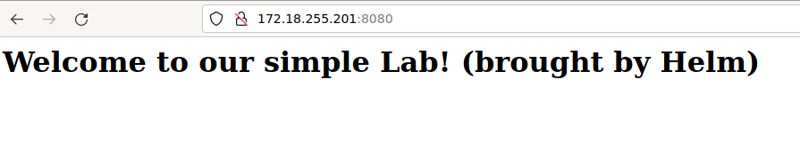

# [4] Package simple `nginx` application into an helm chart

The idea is to now package inside an `helm` Chart what we have created in [3] using `k8s` manifests

With `helm` we can abstract the `k8s` manifests and packaging them

Move in `helm-nginx` folder

The current folder structure is


```
.
├── Chart.yaml
├── templates
│   ├── configmap.yaml
│   ├── deployment.yaml
│   └── svc.yaml
└── values.yaml

```

Create the `helm-nginx` namespace to hold the resource that will be created by `helm`

```
kubectl create namespace helm-nginx
```

Install the `helm` chart

```
helm install helm-nginx-lab .
```

Check that the `helm` package is installed running `helm list`

```
$ helm list
NAME          	NAMESPACE	REVISION	UPDATED                               	STATUS  	CHART                      	APP VERSION
helm-nginx-lab	default  	1       	2023-03-26 15:17:25.13609936 -0400 EDT	deployed	helm-nginx-laboratory-0.0.1	0.0.1      
```

Get the IP address of the load balancer that is running in `helm-nginx` namespace

```
kubectl get svc -n helm-nginx
```

From the output get the `EXTERNAL-IP` of the `nginx-service` `LoadBalancer`

```
NAME            TYPE           CLUSTER-IP     EXTERNAL-IP      PORT(S)          AGE
nginx-service   LoadBalancer   10.96.77.138   172.18.255.201   8080:31176/TCP   18s
```

Check that the service is reachable (in our case is at http://172.18.255.201:8080/)



## Package the chart via Chart Repository

Now that the Chart configuration has been tested you can package it using `helm package`

Crate a `index.yaml` out of the `Chart` configuration in `helm-nginx`

```
helm repo index .
```

Move `index.yaml` in `helm-artifacts`

```
mv index.yaml ../helm-artifacts/.
```

Still in `helm-nginx` as working directory package the chart and store artifact in under `helm-artifacts` directory

```
helm package . --destination ../helm-artifacts
```

Check that the content of `helm-artifacts` is like the following

```
$ ls helm-artifacts/
helm-nginx-laboratory-0.0.1.tgz  index.yaml
```

